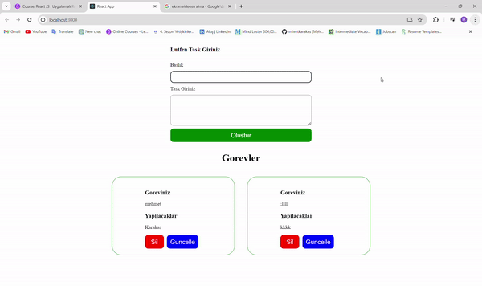

# Tasks

* 

## Project Description: Task Management Application

* This project is a Task Management Application built using React.js and Context API. The application allows users to perform CRUD (Create, Read, Update, Delete) operations on tasks.

## Features:

* Task Listing: Users can view a list of tasks with details such as title, description, deadline, and status.

* Add Task: Users can add a new task by providing a title, description, and deadline. The task is then added to the list.

* Edit Task: Users can edit existing tasks by modifying the title, description, deadline, or status of the task.

* Delete Task: Users can delete tasks from the list, removing them permanently.

## Implementation Details:

+ React Components: The application is divided into reusable React components for better organization and maintainability.

+ Context API: Context API is used to manage the global state of tasks, allowing components to access and modify task data without prop drilling.

+ CRUD Operations: Each CRUD operation (Create, Read, Update, Delete) is implemented using appropriate functions and methods, ensuring data integrity and consistency.

## Conclusion:

* Overall, this Task Management Application provides a user-friendly interface for managing tasks efficiently. By leveraging React.js and Context API, it offers a scalable and maintainable solution for task management needs.